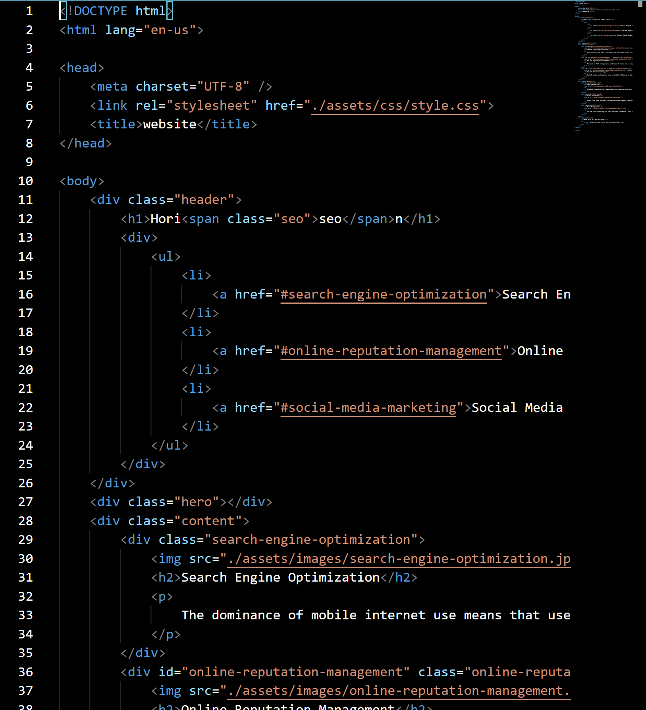

# CodeRefactorSEO

## Desciption
The below description outlines the approach taken to refactor the code base of a website that has not been developed according to current standards for accesibility and search engine optimization.
[Reference for accessibility standards](https://www.w3.org/TR/2018/REC-WCAG21-20180605/)

The revisions align with the user-story and acceptance-criteria.

## Table of Contents

* [User Story](#User-story)
* [Acceptance Criteria](#Acceptance-Criteria)
* [Sketch Up](#Sketch-Up)

## User-story

```
AS A marketing agency
I WANT a codebase that follows accessibility standards
SO THAT our own site is optimized for search engines
```


## Acceptance-Criteria

```
GIVEN a webpage meets accessibility standards
WHEN I view the source code
THEN I find semantic HTML elements
WHEN I view the structure of the HTML elements
THEN I find that the elements follow a logical structure independent of styling and positioning
WHEN I view the image elements
THEN I find accessible alt attributes
WHEN I view the heading attributes
THEN they fall in sequential order
WHEN I view the title element
THEN I find a concise, descriptive title
```

## Sketch-Up

The original code is functioning and works appropriately. However, the code lacks comments, does not align with current conventions for accessibility, and requires rework with indentation.

Below is a screenshot of the original code:


Below is the first round of revisions which target sectioning and other CSS styles:


The next step was to begin refactoring the CSS to be more useable:


